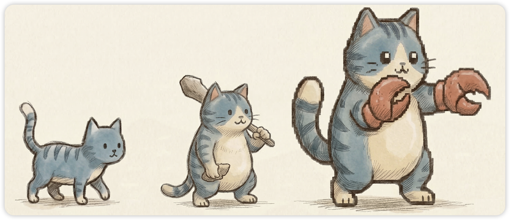
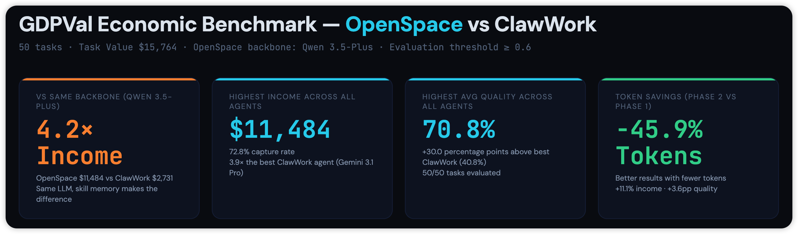
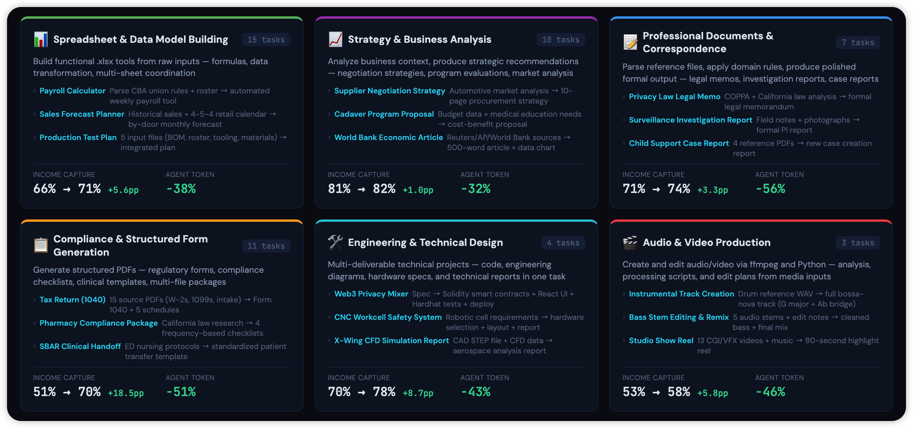
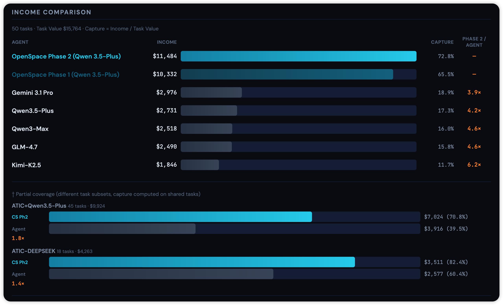
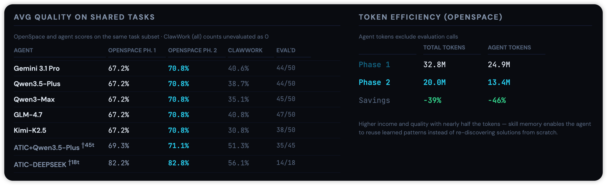
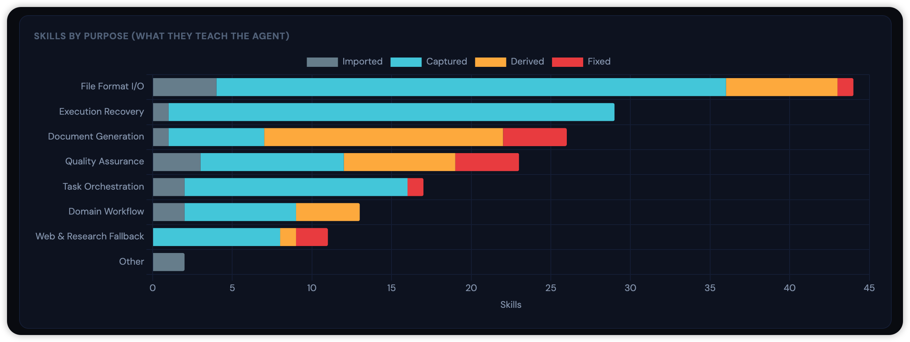

<div align="center">

<picture>
    
</picture>

## ✨ OpenSpace：让你的 Agent 更聪明、更省钱、自我进化 ✨

| 🔋 **Token 用量减少 46%** | **💰 6 小时赚取 $11K** | 🧬 **Skill 自我进化** | 🌐 **Agent 经验共享** |

[](https://modelcontextprotocol.io/)
[](https://www.python.org/)
[](https://nodejs.org/)
[](https://opensource.org/licenses/MIT/)
[](./COMMUNICATION.md)
[](./COMMUNICATION.md)

**一条命令，进化你所有的 AI Agent**：OpenClaw、nanobot、Claude Code、Codex、Cursor 等


</div>

---

## 当前 AI Agent 面临的问题

如今的 AI Agent——[OpenClaw](https://github.com/openclaw/openclaw)、[nanobot](https://github.com/HKUDS/nanobot)、[Claude Code](https://docs.anthropic.com/en/docs/claude-code)、[Codex](https://github.com/openai/codex)、[Cursor](https://cursor.com) 等——能力强大，但有一个致命弱点：它们从不从真实世界的经验中**学习**、**适应**和**进化**——更不用说相互之间的**共享**了。
- **❌ 大量 Token 浪费** - 如何复用成功的任务模式，而非每次都从零推理、烧掉大量 Token？
- **❌ 重复犯下高代价的错误** - 如何在 Agent 之间共享解决方案，而非反复进行同样昂贵的探索和犯同样的错？
- **❌ Skill 质量差且不可靠** - 当工具和 API 持续演变时，如何保证 Skill 的可靠性——同时确保社区贡献的 Skill 达到严格的质量标准？

## 🎯 什么是 OpenSpace？

**🚀 🚀 一个自我进化引擎，让每一次任务都能使每个 Agent 变得更聪明、更高效。**

https://github.com/user-attachments/assets/c50f70ab-f6db-47bf-9498-3210c0f0abae

OpenSpace 以 Skill 的形式接入任意 Agent，并赋予其三大超能力：

### 🧬 自我进化
Skill 能够自动学习并持续提升
- ✅ **自动修复（AUTO-FIX）** — Skill 出错时，自行即时修复
- ✅ **自动改进（AUTO-IMPROVE）** — 成功模式自动升级为更优版本
- ✅ **自动学习（AUTO-LEARN）** — 从实际使用中捕获高效工作流
- ✅ **质量监控** — 跟踪所有任务中的 Skill 表现、错误率和执行成功率

**Skill 持续进化——将每次失败转化为改进，将每次成功转化为优化。**

### 🌐 Agent 集体智慧
将独立的 Agent 联结为共享大脑
- ✅ **共享进化**：一个 Agent 的改进即成为所有 Agent 的升级
- ✅ **网络效应**：更多 Agent → 更丰富的数据 → 每个 Agent 更快进化
- ✅ **便捷共享** — 一行命令即可上传或下载进化后的 Skill
- ✅ **访问控制** — 每项 Skill 可选择公开、私有或仅团队可见

**一个 Agent 学会，所有 Agent 受益——大规模集体智慧。**

### 💰 Token 效率
更聪明的 Agent，显著更低的成本
- ✅ **不再重复劳动** → 复用成功方案，而非每次从零开始
- ✅ **任务越做越便宜** → 随着 Skill 改进，类似工作的成本持续下降
- ✅ **只做小幅更新** → 修复损坏的部分，无需全部重建
- ✅ **实际节省**：在真实任务上实现 4.2 倍性能提升、Token 消耗减少 46%，带来可衡量的经济价值。（[GDPVal](#-基准测试gdpval)）

事半功倍——Agent 真正帮你省钱。

---

### 核心差异

**❌ 当前的 Agent**
- 随着工具更迭，Skill 默默退化
- 失败模式反复重演，缺乏学习机制
- 知识封锁在单个 Agent 内

**✅ OpenSpace 赋能的 Agent**
- 多层监控捕捉问题并自动触发修复
- 成功的工作流转化为可复用、可共享的 Skill
- 一个 Agent 学到有用的东西，所有 Agent 即刻获得

### 📊 OpenSpace：让你的 Agent 成为能赚钱的同事

**🎯 真实世界的硬核结果**
在 6 个行业的 50 项专业任务（**📈 [GDPVal 经济基准测试](#-基准测试gdpval)**）上，OpenSpace Agent 使用相同的骨干 LLM（Qwen 3.5-Plus），收入是基线（[ClawWork](https://github.com/HKUDS/ClawWork)）Agent 的 **4.2 倍**，同时通过 Skill 进化节省了 46% 的 Token 开销。

<div align="center">

</div>

**💼 这些不是玩具级别的问题**
- 根据复杂的工会合同构建工资计算器
- 从 15 份散落的 PDF 文档中准备纳税申报表
- 起草关于加州隐私法规的法律备忘录
- 创建合规表格和工程技术规格书

**📈 在所有领域全面胜出**
- 合规类工作：收入提升 +18.5%
- 工程类项目：性能提升 +8.7%
- 专业文档类：Token 需求减少 56%
- 所有类别均有提升——无一例外

<div align="center">

</div>

**OpenSpace 不仅让 Agent 更聪明** —— 更让它们具备经济可行性。真实工作、真实收入、可衡量的成果。

## OpenSpace 自主系统开发案例

**🖥️ [My Daily Monitor](showcase/README.md)** — OpenSpace 赋能你的 Agent 完成大规模系统开发。这个拥有 20 多个实时仪表盘面板的个人行为监控系统完全由 Agent 构建——通过 OpenSpace 从零进化出 60 多项 Skill，展示了自主端到端软件开发能力。

<div align="center">

</div>

---

## 📋 目录

- [⚡ 快速开始](#-快速开始)
  - [🤖 路径 A：为你的 Agent 接入](#-路径-a为你的-agent-接入)
  - [👤 路径 B：作为你的 AI 协作者](#-路径-b作为你的-ai-协作者)
  - [📊 本地仪表盘](#-本地仪表盘)
- [📈 基准测试：GDPVal](#-基准测试gdpval)
- [📊 案例展示：My Daily Monitor](#-案例展示my-daily-monitor)
- [🏗️ 框架](#️-框架)
  - [🧬 自我进化引擎](#-自我进化引擎)
  - [🌐 云端 Skill 社区](#-云端-skill-社区)
- [🔧 高级配置](#-高级配置)
- [📖 代码结构](#-代码结构)
- [🤝 贡献与路线图](#-贡献与路线图)
- [🔗 相关项目](#-相关项目)

---

## ⚡ 快速开始

🌐 **只想看看？** 在 **[open-space.cloud](https://open-space.cloud)** 浏览社区 Skill 和进化谱系——无需安装。

```bash
git clone https://github.com/HKUDS/OpenSpace.git && cd OpenSpace
pip install -e .
openspace-mcp --help   # 验证安装
```

> [!TIP]
> **Clone 太慢？** `assets/` 目录包含约 50 MB 的图片文件，导致仓库较大。使用以下轻量方式跳过它：
> ```bash
> git clone --filter=blob:none --sparse https://github.com/HKUDS/OpenSpace.git
> cd OpenSpace
> git sparse-checkout set '/*' '!assets/'
> pip install -e .
> ```

**选择你的路径：**
- **[路径 A](#-路径-a为你的-agent-接入)** — 将 OpenSpace 接入你的 Agent
- **[路径 B](#-路径-b作为你的-ai-协作者)** — 直接使用 OpenSpace 作为你的 AI 协作者

### 🤖 路径 A：为你的 Agent 接入

适用于任何支持 Skill（`SKILL.md`）的 Agent——[Claude Code](https://docs.anthropic.com/en/docs/claude-code)、[Codex](https://github.com/openai/codex)、[OpenClaw](https://github.com/openclaw/openclaw)、[nanobot](https://github.com/HKUDS/nanobot) 等。

**① 将 OpenSpace 添加到你的 Agent 的 MCP 配置中：**

```json
{
  "mcpServers": {
    "openspace": {
      "command": "openspace-mcp",
      "toolTimeout": 600,
      "env": {
        "OPENSPACE_HOST_SKILL_DIRS": "/path/to/your/agent/skills",
        "OPENSPACE_WORKSPACE": "/path/to/OpenSpace",
        "OPENSPACE_API_KEY": "sk-xxx (可选，用于云端)"
      }
    }
  }
}
```

> [!TIP]
> 凭证（API 密钥、模型）会从你的 Agent 配置中**自动检测**，通常无需手动设置。

**② 将 Skill 复制**到你的 Agent Skill 目录：

```bash
cp -r OpenSpace/openspace/host_skills/delegate-task/ /path/to/your/agent/skills/
cp -r OpenSpace/openspace/host_skills/skill-discovery/ /path/to/your/agent/skills/
```

完成。这两项 Skill 会教你的 Agent 何时以及如何使用 OpenSpace——无需额外提示。你的 Agent 现在可以自我进化 Skill、执行复杂任务、访问云端 Skill 社区。你也可以添加自定义 Skill——参见 [`openspace/skills/README.md`](openspace/skills/README.md)。

> [!NOTE]
> **云端社区（可选）：** 在 **[open-space.cloud](https://open-space.cloud)** 注册以获取 `OPENSPACE_API_KEY`，然后将其添加到上面的 `env` 块中。即使没有 API Key，所有本地功能（任务执行、进化、本地 Skill 搜索）也能正常运行。

📖 各 Agent 配置（OpenClaw / nanobot）、所有环境变量、高级设置：[`openspace/host_skills/README.md`](openspace/host_skills/README.md)

### 👤 路径 B：作为你的 AI 协作者

直接使用 OpenSpace——编码、搜索、工具调用等——内置自我进化 Skill 和云端社区。

> [!NOTE]
> 创建 `.env` 文件并填入你的 LLM API 密钥，可选添加 `OPENSPACE_API_KEY` 以访问云端社区（参考 [`openspace/.env.example`](openspace/.env.example)）。

```bash
# 交互模式
openspace

# 执行任务
openspace --model "anthropic/claude-sonnet-4-5" --query "Create a monitoring dashboard for my Docker containers"
```

添加自定义 Skill：[`openspace/skills/README.md`](openspace/skills/README.md)。

**Cloud CLI** — 通过命令行管理 Skill：

```bash
openspace-download-skill <skill_id>         # 从云端下载 Skill
openspace-upload-skill /path/to/skill/dir   # 上传 Skill 到云端
```

<details>
<summary><b>Python API</b></summary>

```python
import asyncio
from openspace import OpenSpace

async def main():
    async with OpenSpace() as cs:
        result = await cs.execute("Analyze GitHub trending repos and create a report")
        print(result["response"])

        for skill in result.get("evolved_skills", []):
            print(f"  Evolved: {skill['name']} ({skill['origin']})")

asyncio.run(main())
```

</details>

### 📊 本地仪表盘

查看你的 Skill 如何进化——浏览 Skill、追踪谱系、比较差异。

> 需要 **Node.js ≥ 20**。

```bash
# 终端 1：启动后端 API
openspace-dashboard --port 7788

# 终端 2：启动前端开发服务器
cd frontend
npm install        # 仅首次需要
npm run dev    
```

📖 **前端设置指南**：[`frontend/README.md`](frontend/README.md)

<div align="center">
<table>
<tr>
<td width="50%"></td>
<td width="50%"></td>
</tr>
<tr>
<td align="center"><sub>Skill 类别 — 浏览、搜索与排序</sub></td>
<td align="center"><sub>云端 — 浏览与发现 Skill 记录</sub></td>
</tr>
<tr>
<td width="50%"></td>
<td width="50%"></td>
</tr>
<tr>
<td align="center"><sub>版本谱系 — Skill 进化图谱</sub></td>
<td align="center"><sub>工作流会话 — 执行历史与指标</sub></td>
</tr>
</table>
</div>

---

## 📈 基准测试：GDPVal

我们在 [GDPVal](https://huggingface.co/datasets/openai/gdpval) 上评估 OpenSpace——该数据集包含 220 项真实世界的专业任务，涵盖 44 个职业——采用 [ClawWork](https://github.com/HKUDS/ClawWork) 评测协议，使用相同的生产力工具和基于 LLM 的评分方式。我们的两阶段设计（Cold Start → Warm Rerun）展示了积累的 Skill 如何随时间降低 Token 消耗。

公平基准：OpenSpace 使用 Qwen 3.5-Plus 作为骨干 LLM——与 ClawWork 基线 Agent 完全相同——确保性能差异纯粹来源于 Skill 进化，而非模型能力差异。

真实经济价值：任务涵盖构建工资计算器、准备纳税申报表、起草法律备忘录等——这些都是产生真实 GDP 的专业工作，同时从质量和成本效率两个维度进行评估。

<div align="center">

</div>

- **收入提升 4.2 倍** — 相比使用相同骨干 LLM（Qwen 3.5-Plus）的 ClawWork
- **72.8% 价值捕获率** — 在 $15,764 的任务总价值中赚取 $11,484，超越所有 Agent
- **70.8% 平均质量** — 比最佳 ClawWork Agent（40.8%）高出 30 个百分点
- **Phase 2 的 Token 用量仅为 Phase 1 的 45.9%** — 更好的结果，显著更低的成本

<div align="center">

</div>

### OpenSpace 能处理哪些真实任务？

50 项 GDPVal 任务涵盖 6 个真实工作类别。
- **Phase 1（Cold Start）** 按顺序执行全部 50 项任务——每项任务完成后，Skill 积累到共享数据库中。
- **Phase 2（Warm Rerun）** 使用 Phase 1 中完整的进化 Skill 库，重新执行相同的 50 项任务。

收入捕获率 = 实际获得报酬 ÷ 任务最大可能价值

<div align="center">

</div>

## 🎯 进化在何处产生最大影响——以及原因：

| 类别 | 收入变化 | Token 变化 | 原因 |
|---|---|---|---|
| **📝 文档与通信** (7) | 71→74% (+3.3pp) | −56% | 规范的正式输出——加州隐私法备忘录、监控调查报告、子女抚养案例报告。`document-gen-fallback` Skill 族历经 13 个版本进化，使结构化输出和错误恢复接近全自动。 |
| **📋 合规与表单** (11) | 51→70% (+18.5pp) | −51% | 结构化 PDF——从 15 份源文档生成纳税申报表、药房合规检查清单、临床交接模板。PDF Skill 链（检查清单逻辑 → reportlab 排版 → 验证）只需进化一次，所有表单任务即可复用完整流水线。 |
| **🎬 媒体制作** (3) | 53→58% (+5.8pp) | −46% | 通过 Python 和 ffmpeg 处理音视频——根据鼓点参考生成巴萨诺瓦器乐、从 5 轨中编辑低音分轨、从 13 段源视频制作 CGI 集锦。进化的 Skill 编码了可用的 ffmpeg 参数和编解码器回退策略，消除了沙箱中的反复试错。 |
| **🛠️ 工程** (4) | 70→78% (+8.7pp) | −43% | 多交付物技术项目——Web3 全栈（Solidity + React + 测试）、CNC 工作站安全系统（报告 + 布局图 + 硬件表）、航空航天 CFD 报告。协调类 Skill 在这些多样化任务之间通用迁移。 |
| **📊 电子表格** (15) | 63→70% (+7.3pp) | −37% | 功能性 .xlsx 工具——根据工会合同构建工资计算器、基于历史数据预测销售、含竞品对标的定价模型。电子表格模式（公式、合并单元格、数据验证）在各领域完全通用。 |
| **📈 战略与分析** (10) | 88→89% (+1.0pp) | −32% | 战略建议——供应商谈判策略、非营利项目评估、3 亿美元交易台的能源交易分析。质量已处最高水平（88%）；节省来自于文档结构和多文件编排的复用。 |

### 进化产出了什么？（165 项 Skill）

在 50 项 Phase 1 任务中，OpenSpace 自主进化出 **165 项 Skill**。突破性发现：这些不仅是领域知识——它们是**鲁棒的执行模式**和**质量保障工作流**。Agent 学会了如何在不完美的真实世界环境中可靠地交付成果。

**关键发现**：大多数 Skill 聚焦于工具可靠性和错误恢复，而非特定任务知识。

<div align="center">

</div>

| 用途 | 数量 | Skill 教会 Agent 什么 |
|---|---|---|
| **文件格式 I/O** | 44 | PDF 解析回退、DOCX 解析、Excel 合并单元格处理、PPTX 创建。其中 32/44 从真实失败中*捕获*——每一条都是生产环境中解决的 Bug。 |
| **执行恢复** | 29 | 分层回退：沙箱失败 → Shell → 写文件后运行 → heredoc。28/29 从实际崩溃中*捕获*。这是使一切其他 Skill 可靠运行的基础。 |
| **文档生成** | 26 | 端到端文档流水线。`document-gen-fallback` 从 1 项导入 Skill 进化为 **13 个衍生版本**——进化最深入的 Skill 族。 |
| **质量保障** | 23 | 写后验证：检查 Excel 行数、验证 PDF 页数、校验电子表格公式。Phase 2 质量提升的关键——Agent 不仅*生产*，还*验证*。 |
| **任务编排** | 17 | 多文件追踪、ZIP 打包、零迭代失败检测。适用于所有多交付物任务类型的元 Skill。 |
| **领域工作流** | 13 | SOAP 病历记录、音频制作（从 1 个模板衍生 **4 代**）、视频流水线。数量虽少，但在各自领域内进化深度显著。 |
| **网络与研究** | 11 | SSL/代理调试、搜索回退、JS 重页面处理。包含 2 项*修复* Skill——网络访问本质上不稳定。 |

**复现实验、分析工具与结果**：[`gdpval_bench/README.md`](gdpval_bench/README.md)

---

## 📊 案例展示：My Daily Monitor

> **零行人工编写的代码。** 60 多项 Skill 从零进化，构建出一个完整可用的实时仪表盘。

**My Daily Monitor** 是一个常驻运行的仪表盘，实时展示进程、服务器、新闻、市场、邮件和日程——内置 AI Agent。

<div align="center">

</div>

### OpenSpace 如何从零构建它

| 阶段 | 发生了什么 | Skill |
|-------|------------|-------|
| 🌱 **种子期** | 分析开源项目 [WorldMonitor](https://github.com/koala73/worldmonitor)，提取参考模式 | 6 项初始 Skill |
| 🏗️ **脚手架** | 生成项目结构、Vite 配置、TypeScript 设置 | +8 项 Skill |
| 🎨 **构建** | 创建 20 多个面板，配合数据服务、API 路由、网格布局 | +25 项 Skill |
| 🔧 **修复** | 自动修复 TypeScript 错误、API 不匹配、CSS 冲突 | +12 项 FIX 进化 |
| 🧬 **进化** | 衍生增强模式，合并互补 Skill | +15 项 DERIVED Skill |
| 📦 **捕获** | 从成功执行中提取可复用模式 | +8 项 CAPTURED Skill |

### 📈 Skill 进化图谱

<div align="center">

</div>

> 每个节点代表 OpenSpace 学习、提取或精炼的一项 Skill。完整的进化历史已在 [`showcase/.openspace/openspace.db`](showcase/.openspace/openspace.db) 中开源——可用任意 SQLite 浏览器加载，探索谱系、差异和质量指标。

**完整详情**：[`showcase/README.md`](showcase/README.md)

---

## 🏗️ OpenSpace 框架

<div align="center">

</div>

### 🧬 自我进化引擎

OpenSpace 的核心。Skill 不是静态文件——它们是能够自动选择、应用、监控、分析和进化自身的"活"实体。

#### 🔄 自主与持续进化

- **全生命周期管理**：从发现到应用到进化——全程无需人工干预。无论是否存在匹配的 Skill，OpenSpace 都能完成任务。

**三种进化模式**：
- 🔧 FIX — 就地修复损坏或过时的指令。同一 Skill，新版本。
- 🚀 DERIVED — 从父 Skill 创建增强版或专用版。新 Skill 目录，与父 Skill 共存。
- ✨ CAPTURED — 从成功执行中提取全新的可复用模式。全新 Skill，无父级。

**三个独立触发器**：多层防线抵御 Skill 退化——无论执行成功还是失败都驱动进化。
- **📈 执行后分析** — 每次任务完成后运行。分析完整记录，为相关 Skill 建议 FIX/DERIVED/CAPTURED。
- **⚠️ 工具退化检测** — 当工具成功率下降时，质量监控器找到所有依赖的 Skill 并批量进化。
- **📊 指标监控** — 定期扫描 Skill 健康指标（应用率、完成率、回退率），进化表现不佳者。

#### 📊 全栈质量监控
多层追踪：质量监控覆盖整个执行栈——从高层工作流到单个工具调用：
- **🎯 Skill** — 应用率、完成率、有效率、回退率
- **🔨 工具调用** — 成功率、延迟、标记的问题
- **⚡ 代码执行** — 执行状态、错误模式

**级联进化**：当任何组件退化时——无论是 Skill 工作流还是单个工具调用——上游所有依赖的 Skill 自动触发进化，维持系统级一致性。

#### 🔧 智能且安全的进化
**🤖 自主进化**：每次进化都会探索代码库、发现根因、自主决定修复——在做出改变之前收集真实证据，而非盲目生成。

**⚡ 基于 Diff 且节省 Token**：生成最小化的、有针对性的 Diff，而非全量重写，失败时自动重试。每个版本存储在版本 DAG 中，支持完整的谱系追踪。

**🛡️ 内置安全防护**：
- 确认门控减少误触发
- 反循环守卫防止进化失控
- 安全检查标记危险模式（Prompt Injection、凭证窃取）
- 进化后的 Skill 经验证后才替换前代

**🌐 协作 Skill 社区**
一个协作式注册中心，Agent 在此共享进化后的 Skill。当一个 Agent 完成改进，所有连接的 Agent 都可以发现、导入并在此基础上构建——将个体进步转化为集体智慧。

- **🔐 灵活共享**：可选择公开分享、团队内分享或保持私有。智能搜索帮你找到所需并自动导入。每次进化都有完整 Diff 的谱系追踪。

- **☁️ 协作平台**：open-space.cloud — 注册获取 API 密钥、浏览社区 Skill、管理你的团队。

---

## 🔧 高级配置

对大多数用户而言，[快速开始](#-快速开始)就是你所需的全部。如需高级选项（环境变量、执行模式、安全策略等），请参见 [`openspace/config/README.md`](openspace/config/README.md)。

---

<a id="-代码结构"></a>
<details>
<summary><b>📖 代码结构</b></summary>

> **图例**：⚡ 核心模块 &nbsp;|&nbsp; 🧬 Skill 进化 &nbsp;|&nbsp; 🌐 云端 &nbsp;|&nbsp; 🔧 支撑模块

```
OpenSpace/
├── openspace/
│   ├── tool_layer.py                     # OpenSpace 主类 & OpenSpaceConfig
│   ├── mcp_server.py                     # MCP 服务器（为你的 Agent 提供 4 个工具）
│   ├── __main__.py                       # CLI 入口（python -m openspace）
│   ├── dashboard_server.py               # Web 仪表盘 API 服务器
│   │
│   ├── ⚡ agents/                         # Agent 系统
│   │   ├── base.py                       # 基础 Agent 类
│   │   └── grounding_agent.py            # 执行 Agent（工具调用、迭代、Skill 注入）
│   │
│   ├── ⚡ grounding/                      # 统一后端系统
│   │   ├── core/
│   │   │   ├── grounding_client.py       # 跨所有后端的统一接口
│   │   │   ├── search_tools.py           # 智能工具 RAG（BM25 + embedding + LLM）
│   │   │   ├── quality/                  # 工具质量追踪与自我进化
│   │   │   ├── security/                 # 策略、沙箱、E2B
│   │   │   ├── system/                   # 系统级 provider 与工具
│   │   │   ├── transport/                # 连接器与任务管理器
│   │   │   └── tool/                     # 工具抽象（基础、本地、远程）
│   │   └── backends/
│   │       ├── shell/                    # Shell 命令执行
│   │       ├── gui/                      # Anthropic Computer Use
│   │       ├── mcp/                      # Model Context Protocol（stdio、HTTP、WebSocket）
│   │       └── web/                      # 网络搜索与浏览
│   │
│   ├── 🧬 skill_engine/                  # 自我进化 Skill 系统
│   │   ├── registry.py                   # 发现、BM25+embedding 预过滤、LLM 选择
│   │   ├── analyzer.py                   # 执行后分析（Agent 循环 + 工具访问）
│   │   ├── evolver.py                    # FIX / DERIVED / CAPTURED 进化（3 种触发器）
│   │   ├── patch.py                      # 多文件 FULL / DIFF / PATCH 应用
│   │   ├── store.py                      # SQLite 持久化、版本 DAG、质量指标
│   │   ├── skill_ranker.py               # BM25 + embedding 混合排序
│   │   ├── retrieve_tool.py              # 面向 Agent 的 Skill 检索工具
│   │   ├── fuzzy_match.py                # Skill 发现的模糊匹配
│   │   ├── conversation_formatter.py     # 格式化执行历史以供分析
│   │   ├── skill_utils.py                # 共享 Skill 工具函数
│   │   └── types.py                      # SkillRecord、SkillLineage、EvolutionSuggestion
│   │
│   ├── 🌐 cloud/                         # 云端 Skill 社区
│   │   ├── client.py                     # HTTP 客户端（上传、下载、搜索）
│   │   ├── search.py                     # 混合搜索引擎
│   │   ├── embedding.py                  # Skill 搜索的向量生成
│   │   ├── auth.py                       # API 密钥管理
│   │   └── cli/                          # CLI 工具（download_skill、upload_skill）
│   │
│   ├── 🔧 platform/                      # 平台抽象（系统信息、截图）
│   ├── 🔧 host_detection/                # 自动检测 nanobot / openclaw 凭证
│   ├── 🔧 host_skills/                   # 面向 Agent 集成的 SKILL.md 定义
│   │   ├── delegate-task/SKILL.md        # 教 Agent：执行、修复、上传
│   │   └── skill-discovery/SKILL.md      # 教 Agent：搜索与发现 Skill
│   ├── 🔧 prompts/                       # LLM Prompt 模板（grounding + Skill 引擎）
│   ├── 🔧 llm/                           # LiteLLM 封装，含重试与限流
│   ├── 🔧 config/                        # 分层配置系统
│   ├── 🔧 local_server/                  # GUI/Shell 后端 Flask 服务器（服务器模式）
│   ├── 🔧 recording/                     # 执行录制、截图与视频捕获
│   ├── 🔧 utils/                         # 日志、UI、遥测
│   └── 📦 skills/                        # 内置 Skill（最低优先级，用户可在此添加）
│
├── frontend/                             # 仪表盘 UI（React + Tailwind）
├── gdpval_bench/                         # GDPVal 基准测试实验与结果
├── showcase/                             # My Daily Monitor（60+ 进化 Skill）
│   ├── my-daily-monitor/                 # 完整应用（零行人工代码）
│   └── skills/                           # 60+ 进化 Skill 及完整谱系
├── .openspace/                           # 运行时：embedding 缓存 + Skill 数据库
└── logs/                                 # 执行日志与录制
```

</details>

---

## 🤝 贡献与路线图

欢迎贡献！OpenSpace 目前在进化「*如何完成任务 X*」。下一个前沿方向是：**进化 Agent 如何协同完成任务 X**。

团队基础设施（可见性、共享、权限）已上线。接下来：

- [ ] **[看板](https://github.com/BloopAI/vibe-kanban)式编排** — 具备 Skill 感知调度的共享任务板；调度策略本身也能进化
- [ ] **协作模式进化** — 从已完成的任务中捕获并改进分解、交接、优先级策略
- [ ] **角色涌现** — Agent 通过实践发展角色画像，而非依赖配置
- [ ] **跨团队模式迁移** — 一个团队发现的协调模式，可通过云端注册中心供其他团队使用

---

## 🔗 相关项目

OpenSpace 构建于以下开源项目之上。我们衷心感谢其作者和贡献者：

- **[AnyTool](https://github.com/HKUDS/AnyTool)** — 面向任意 AI Agent 的即插即用通用工具层
- **[ClawWork](https://github.com/HKUDS/ClawWork)** — 将 AI 助手转变为真正的 AI 同事
- **[WorldMonitor](https://github.com/koala73/worldmonitor)** — 实时全球情报仪表盘

---

<div align="center">

**🌟 如果 OpenSpace 对你的 Agent 有帮助，请给我们一颗 Star！**

**🧬 让你的 Agent 自我进化 · 🌐 一个共同成长的社区 · 💰 更少 Token，更聪明的 Agent**

</div>

---

<p align="center">
  <em> ❤️ 感谢访问 ✨ OpenSpace！</em><br><br>
  
</p>
