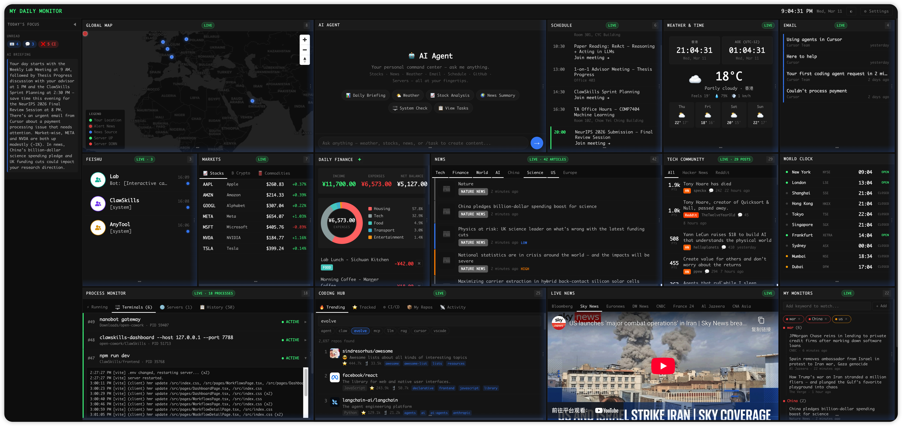
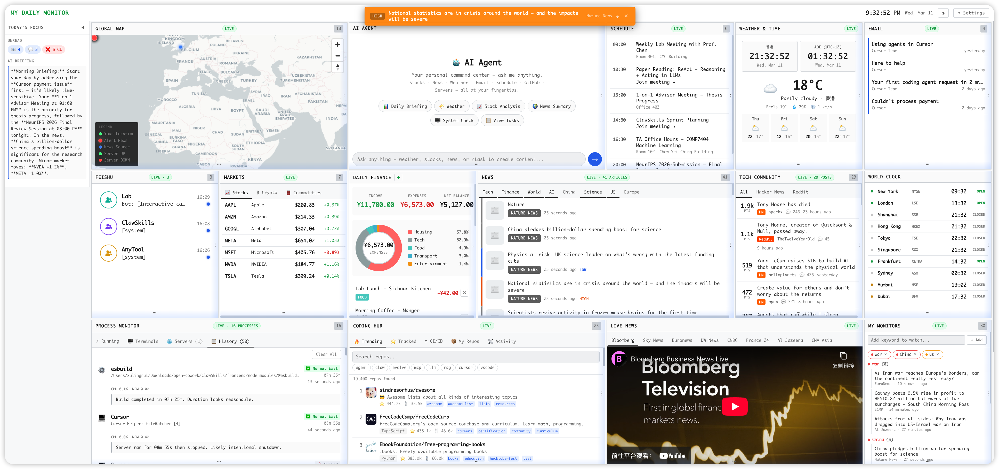
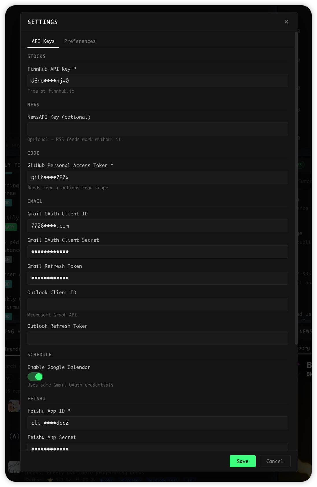
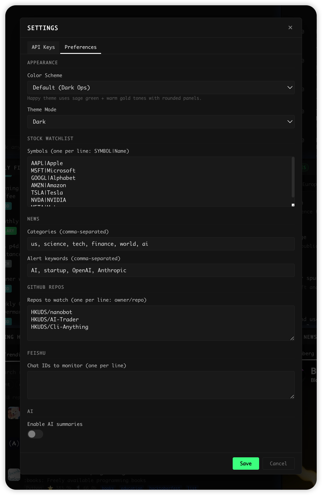
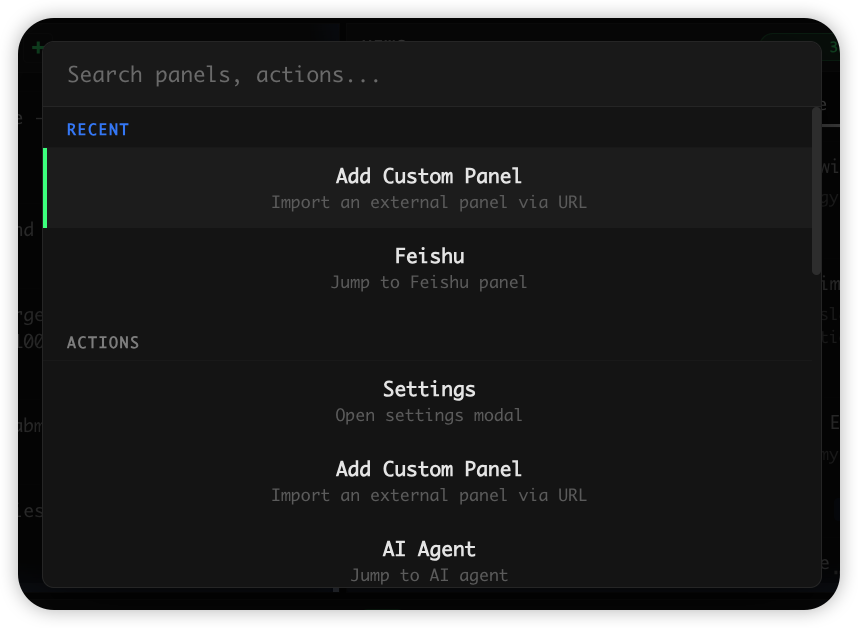
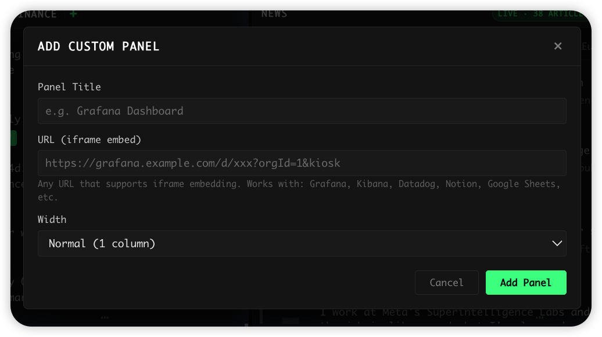
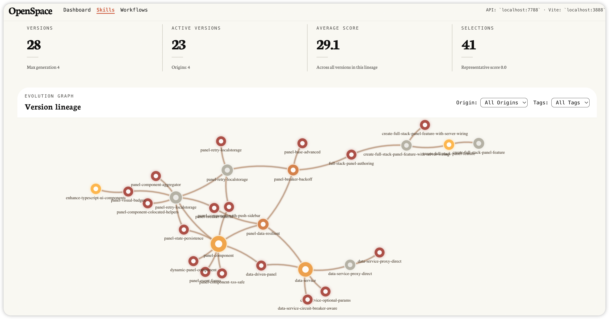

<div align="center">

# 🖥️ My Daily Monitor

### **Your Entire Day on One Live Screen — with an AI Agent That Works for You**

**Fully generated & evolved by [OpenSpace](https://github.com/HKUDS/OpenSpace) — zero human code**

<p>
<a href="https://github.com/HKUDS/OpenSpace"></a>


</p>



<sub>Dark Mode</sub>&nbsp;&nbsp;&nbsp;&nbsp;

<details>
<summary>Light Mode</summary>

</details>

</div>

## Table of Contents

- [What is My Daily Monitor?](#-what-is-my-daily-monitor)
- [Quick Start](#-quick-start)
- [How Was It Generated?](#-how-was-it-generated--openspace-skill-evolution)
- [Project Structure](#%EF%B8%8F-project-structure)
- [Related](#-related)

---

## 📖 What is My Daily Monitor?

**My Daily Monitor** is an always-on **live** dashboard that streams your processes, servers, terminals, news, markets, messages, and schedules into one screen — with a built-in AI agent that can answer questions, provide analysis, and get work done for you.

### 🔑 Why It Matters

- **🖥️ Live Process & Terminal Monitor** — Dev servers, training jobs, SSH sessions, Docker containers — all visible with live CPU/memory bars, PID tracking, and terminal output tailing. Remote server URL probes for instant UP/DOWN checks. Crash/OOM detection tells you what happened without digging through logs.
- **🤖 An Expert Always by Your Side** — The AI Agent has live access to every data source on your dashboard. "Why did my build fail?" — it pulls CI logs + process history to analyze. "Summarize today's Feishu threads" — done. Need a PPT? It generates and executes Python code. Always-on, wake it anytime for answers, analysis, or real work.
- **📡 Everything Streams, Nothing Is Stale** — Stock tickers, Bloomberg live TV, world news, HN/Reddit, Gmail, Calendar, Feishu — all auto-refreshing. Breaking news triggers desktop notifications. Keyword monitors track any topic across all sources in real time.
- **📋 Today's Focus** — Sidebar with next-meeting countdown, unread badges, CI failure alerts, stock movers, and AI daily briefing — open the dashboard and know what needs attention.
- **🔧 One Screen, Zero Context Switching** — No more jumping between `htop`, terminal tabs, Gmail, stock apps, and Slack. Every panel is self-contained, auto-refreshing, and resilient.

### 📋 Panel Overview

| Category | Panels | What You See |
|----------|--------|-------------|
| 🖥️ **DevOps & System** | Process Monitor, System Health, Coding Hub | All running processes & terminals, remote server probes, CPU/MEM, GitHub CI/CD, trending repos |
| 🤖 **AI Agent** | AI Agent, Today's Focus | Chat with your data, generate content, daily briefing with aggregated alerts |
| 📊 **Markets & Finance** | Stock Market, Daily Finance | Live stock/crypto/commodity tickers, income & expense tracking |
| 📰 **Information** | News, Live News, Tech Community, My Monitors | Categorized news feeds, Bloomberg live stream, HN/Reddit, custom keyword alerts |
| 📅 **Productivity** | Schedule, Email, Feishu | Google Calendar, Gmail inbox, Feishu/Lark bot messages |
| 🌍 **Overview** | Global Map, Weather, World Clock, Quick Links | News pinned on a world map, weather forecast, multi-timezone clocks |

---

## 🚀 Quick Start

### 1. Install Dependencies

```bash
cd my-daily-monitor
npm install
```

### 2. Start the Development Server

```bash
npm run dev
```

This starts the Vite dev server with the embedded API plugin at [http://localhost:5173](http://localhost:5173). No separate backend server is needed — API routes are handled by the Vite plugin.

### 3. Configure

Open the dashboard and click **⚙ Settings** in the top-right corner. Add your API keys for the data sources you want to enable:

<div align="center">
<table>
<tr>
<td align="center"><b>API Keys</b></td>
<td align="center"><b>Preferences</b></td>
</tr>
<tr>
<td></td>
<td></td>
</tr>
</table>
</div>

#### API Keys

| Key | Required For | How to Get |
|-----|-------------|-----------|
| `FINNHUB_API_KEY` | Stock Market | [finnhub.io](https://finnhub.io/) (free) |
| `NEWSAPI_KEY` | News Feed (optional) | [newsapi.org](https://newsapi.org/) — RSS feeds work without it |
| `GITHUB_PAT` | Code Status (CI/CD) | GitHub → Settings → PAT (`repo` + `actions:read`) |
| `GMAIL_CLIENT_ID` | Email + Calendar | Google Cloud Console OAuth |
| `GMAIL_CLIENT_SECRET` | Email + Calendar | Google Cloud Console OAuth |
| `GMAIL_REFRESH_TOKEN` | Email + Calendar | OAuth flow |
| `GOOGLE_CALENDAR_ENABLED` | Calendar (toggle) | Uses same Gmail OAuth credentials |
| `OUTLOOK_CLIENT_ID` | Email (Outlook) | Microsoft Azure App Registration |
| `OUTLOOK_REFRESH_TOKEN` | Email (Outlook) | Microsoft Graph OAuth flow |
| `FEISHU_APP_ID` | Feishu Messages | Feishu Open Platform |
| `FEISHU_APP_SECRET` | Feishu Messages | Feishu Open Platform |
| `TWITTER_BEARER_TOKEN` | Social Feed | Twitter Developer Portal |
| `OPENROUTER_API_KEY` | AI Agent | [openrouter.ai](https://openrouter.ai/) |
| `OPENROUTER_MODEL` | AI Model (optional) | Default: `minimax/minimax-m2.5` |

> [!TIP]
> Not all API keys are required. The dashboard works incrementally — each panel gracefully handles missing configuration and shows setup instructions.

#### Preferences

| Preference | What It Controls |
|-----------|-----------------|
| Color Scheme / Theme Mode | Appearance: color scheme and dark/light mode |
| Stock Watchlist | Symbols to track (`SYMBOL\|Name`, one per line) |
| News Categories | Topic filters (e.g. `us, science, tech, finance, world, ai`) |
| News Alert Keywords | Keyword highlights across all news sources |
| GitHub Repos | Repos to monitor for CI/CD (`owner/repo`, one per line) |
| Feishu Chat IDs | Feishu group chats to stream messages from |
| AI Summaries | Toggle AI-generated daily briefing on/off |

#### Customization

<div align="center">
<table>
<tr>
<td align="center"><b>Command Palette</b> <code>Cmd/Ctrl+K</code><br/>Jump to any panel, trigger actions</td>
<td align="center"><b>Custom Panels</b><br/>Embed any URL (Grafana, Notion, etc.)</td>
</tr>
<tr>
<td></td>
<td></td>
</tr>
</table>
</div>

---

## 🧬 How Was It Generated? — OpenSpace Skill Evolution

> **Zero human code was written.** The entire project — every panel, service, style, and API route — was generated and iteratively evolved by [OpenSpace](https://github.com/HKUDS/OpenSpace) with no manual coding involved.

### The Process

1. **Seed Reference**: OpenSpace started by analyzing the open-source project [WorldMonitor](https://github.com/koala73/worldmonitor) — a real-time global intelligence dashboard built with vanilla TypeScript.

2. **Skill Extraction**: OpenSpace extracted an initial set of **6 skills** from WorldMonitor's codebase:
   - `codebase-pattern-analyzer` — How to analyze a codebase and identify reusable patterns
   - `skill-template-generator` — How to generate skill templates from identified patterns
   - `worldmonitor-reference` — Architecture index: Panel class hierarchy, service layer, CSS grid, API edge functions
   - `panel-component` — Base Panel class pattern with loading/error states
   - `data-service` — Service module conventions
   - `panel-grid-layout` — Responsive CSS grid system

3. **Domain Adaptation**: Using the `personal-monitor-domain` skill, OpenSpace defined the target panels, data sources, APIs, and priority ordering for a **personal** daily monitor (as opposed to WorldMonitor's global scope).

4. **Iterative Evolution**: OpenSpace evolved the project step-by-step — each iteration added new panels, refined existing ones, fixed bugs, and extracted new skills from the evolving codebase. The skills themselves self-evolved, becoming more specific and battle-tested over time.

### 📈 Evolution Graph

The following graph shows the skill evolution path — how OpenSpace progressively built and refined the dashboard through multiple iterations:

<div align="center">

</div>

> Each node represents a skill that OpenSpace learned, extracted, or refined during the development process. The graph illustrates how initial reference patterns from WorldMonitor branched into specialized skills for panel creation, data services, full-stack feature authoring, and more.

### 📂 Evolved Skills & Evolution DB

Through iterative evolution, OpenSpace accumulated **60+ skills** spanning multiple categories. Examples:

- **Panel patterns**: `panel-component`, `panel-base-advanced`, `panel-visual-badges`, ...
- **Data services**: `data-service`, `data-service-circuit-breaker-aware`, `data-service-proxy-direct`, ...
- **Full-stack workflows**: `create-full-stack-panel-feature`, `full-stack-panel-authoring`, ...
- **Infrastructure**: `refresh-scheduler`, `api-proxy-endpoint`, `project-scaffold`, ...
- **Reliability**: `typescript-compile-check-resilient`, `unicode-safe-file-writing`, `idempotent-file-replace`, ...

The full evolution history — every skill version, derivation chain, and quality score — is stored in the open-sourced [`showcase/.openspace/openspace.db`](.openspace/openspace.db) SQLite database.

---

<details>
<summary><b>🏗️ Project Structure</b></summary>

```
my-daily-monitor/
├── index.html                  # Entry HTML with flash-free theme init
├── vite.config.ts              # Vite config with embedded API plugin
├── vite-api-plugin.ts          # API routes served via Vite middleware
├── src/
│   ├── main.ts                 # App entry — panel instantiation, grid layout, scheduler
│   ├── components/             # All UI panel classes (29 components)
│   │   ├── Panel.ts            # Base Panel class (all panels extend this)
│   │   ├── StockPanel.ts       # Stock market watchlist
│   │   ├── NewsPanel.ts        # Aggregated news headlines
│   │   ├── EmailPanel.ts       # Gmail inbox
│   │   ├── InsightsPanel.ts    # AI Agent with tool routing
│   │   ├── MapPanel.ts         # MapLibre GL world map
│   │   ├── CommandPalette.ts   # Cmd+K command palette
│   │   ├── SettingsModal.ts    # API key configuration
│   │   └── ...                 # 20+ more panel components
│   ├── services/               # Data fetching layer (14 services)
│   │   ├── stock-market.ts     # Finnhub stock quotes
│   │   ├── news.ts             # GNews + HackerNews aggregation
│   │   ├── email.ts            # Gmail API integration
│   │   ├── schedule.ts         # Google Calendar events
│   │   ├── ai-summary.ts       # LLM daily briefing generation
│   │   ├── refresh-scheduler.ts# Visibility-aware refresh scheduling
│   │   └── ...
│   ├── config/                 # Settings keys and preferences
│   ├── styles/                 # CSS (dark/light themes, grid layout)
│   └── utils/                  # Helpers (circuit breaker, formatting, sparkline)
└── server/                     # Standalone API server (alternative to Vite plugin)
    ├── index.ts                # Express/tsx server entry
    └── routes/                 # API route handlers
        ├── stock.ts, news.ts, email.ts, github.ts, ...
```

</details>

---

## 🔗 Related

- **[OpenSpace](https://github.com/HKUDS/OpenSpace)** — Self-evolving skill worker & community for AI agents, the engine that generated this entire project.
- **[WorldMonitor](https://github.com/koala73/worldmonitor)** — Real-time global intelligence dashboard that served as the seed reference for initial skills extraction.
